# Prelims Mock Test Generation Pipeline Documentation

> [!NOTE]
> This document provides a comprehensive guide to understanding the prelims mock test generation pipeline. It includes a detailed flowchart and step-by-step explanations suitable for anyone new to the system.

## Table of Contents
1. [Overview](#overview)
2. [Architecture Flowchart](#architecture-flowchart)
3. [Detailed Pipeline Steps](#detailed-pipeline-steps)
4. [Current Affairs Integration](#current-affairs-integration)
5. [Data Flow & Transformations](#data-flow--transformations)
6. [Key Components](#key-components)

---

## Overview

The prelims mock test generation pipeline is a sophisticated system that generates UPSC-style Geography prelims questions using:
- **Static content** from textbooks and study materials
- **Previous Year Questions (PYQs)** for style learning
- **Current affairs** via Google Search integration
- **AI generation** using Gemini 2.5 Pro with structured output
- **Quality validation** and provenance tracking

### High-Level Flow
```
User Request → Async Job Creation → Content Retrieval → Batch Generation → 
Validation → Deduplication → Gap Filling → Final Selection → Response
```

---

## Architecture Flowchart

```mermaid
flowchart TD
    Start([User Requests Mock Test]) --> API["/mock-test/generate-async API Endpoint"]
    
    API --> Validate{Validate Request}
    Validate -->|Invalid| Error1[Return 400 Error]
    Validate -->|Valid| CreateJob[Create Job ID]
    
    CreateJob --> InitRedis[Initialize Redis Job Status]
    InitRedis --> EnqueueArq[Enqueue Job to Arq Worker]
    EnqueueArq --> ReturnJobID[Return job_id to User]
    
    ReturnJobID --> UserPolls[User Polls /status/job_id]
    
    EnqueueArq -.Background Process.-> WorkerStart[Worker: generate_mock_test_task]
    
    WorkerStart --> MarkStarted[Mark Job as 'started' in Redis]
    
    MarkStarted --> Step1[STEP 1: Content Retrieval]
    
    Step1 --> HybridRetrieval[hybrid_retrieve_for_mock_test]
    HybridRetrieval --> FetchChunks[Fetch n×10 chunks from Pinecone]
    FetchChunks --> BucketChunks[Bucket by metadata hierarchy]
    BucketChunks --> MMRSelection[MMR selection: n×7 chunks]
    MMRSelection --> FetchPYQ[Fetch 10 PYQ chunks for style]
    
    FetchPYQ --> CheckContent{Sufficient Content?}
    CheckContent -->|< 10 chunks| Error2[Raise Exception]
    CheckContent -->|>= 10 chunks| Step2[STEP 2: Micro-Batch Generation]
    
    Step2 --> CalcBatches[Calculate batches: target × 1.1 buffer]
    CalcBatches --> PartitionDomains[Partition chunks by domain]
    PartitionDomains --> DistributeChunks[Distribute chunks round-robin]
    
    DistributeChunks --> ParallelGen[Generate batches in parallel max 3 concurrent]
    
    ParallelGen --> BatchLoop{For each batch}
    
    BatchLoop --> ExtractMeta[Extract metadata from chunks]
    ExtractMeta --> DedupeTopics[Deduplicate topic clusters]
    DedupeTopics --> BuildQueries[Build 2 search queries per cluster]
    
    BuildQueries --> AssemblePrompt[Assemble UPSC prompt with:<br/>- System prompt<br/>- Static content<br/>- PYQ examples<br/>- Search queries]
    
    AssemblePrompt --> GeminiCall[Call Gemini 2.5 Pro with Google Search]
    
    GeminiCall --> ParseJSON[Parse JSON response with fallbacks]
    ParseJSON --> ExtractCA[Extract current_affairs_bullets]
    ExtractCA --> ValidateBatch[Validate batch questions]
    
    ValidateBatch --> CalcQuality[Calculate quality scores]
    CalcQuality --> StoreProvenance[Store in QuestionBank with provenance]
    
    StoreProvenance --> UpdateProgress[Update job progress in Redis]
    UpdateProgress --> BatchLoop
    
    BatchLoop -->|All batches done| Step3[STEP 3: Semantic Deduplication]
    
    Step3 --> EmbedQuestions[Embed all questions]
    EmbedQuestions --> CosineSim[Calculate cosine similarity]
    CosineSim --> FilterDupes[Filter duplicates threshold=0.88]
    
    FilterDupes --> CheckGap{len < target?}
    
    CheckGap -->|Yes| Step4[STEP 4: Gap Filling]
    CheckGap -->|No| Step5[STEP 5: Final Selection]
    
    Step4 --> AnalyzeDist[Analyze domain distribution]
    AnalyzeDist --> TargetDomain[Target underrepresented domain]
    TargetDomain --> RetrieveGap[Retrieve chunks for gap domain]
    RetrieveGap --> GenGapBatch[Generate gap-fill batch]
    GenGapBatch --> Step5
    
    Step5 --> RandomSelect{len > target?}
    RandomSelect -->|Yes| Sample[Random sample to target]
    RandomSelect -->|No| Shuffle[Shuffle questions]
    Sample --> Shuffle
    
    Shuffle --> FormatQuestions[Format as MockTestQuestion objects]
    FormatQuestions --> MarkComplete[Mark job as 'completed' in Redis]
    MarkComplete --> StoreResult[Store result in Redis]
    
    StoreResult --> End([User Receives Questions])
    
    UserPolls -.Polling Loop.-> CheckStatus{Job Status?}
    CheckStatus -->|queued/started| UserPolls
    CheckStatus -->|completed| FetchResult[Fetch result from Redis]
    CheckStatus -->|failed| FetchError[Fetch error from Redis]
    
    FetchResult --> End
    FetchError --> ErrorEnd([Return Error to User])
    
    style Start fill:#e1f5e1
    style End fill:#e1f5e1
    style ErrorEnd fill:#ffe1e1
    style Error1 fill:#ffe1e1
    style Error2 fill:#ffe1e1
    style Step1 fill:#e3f2fd
    style Step2 fill:#e3f2fd
    style Step3 fill:#e3f2fd
    style Step4 fill:#e3f2fd
    style Step5 fill:#e3f2fd
    style GeminiCall fill:#fff3e0
    style StoreProvenance fill:#f3e5f5
```



---

## Detailed Pipeline Steps

### Phase 0: API Request & Job Creation

**File**: [mock_test.py:L1328-L1394](file:///Users/tanishakothari/Documents/Personal/study-buddy/backend/app/routes/mock_test.py#L1328-L1394)

#### What Happens:
1. **User sends POST request** to `/mock-test/generate-async` with:
   ```json
   {
     "num_questions": 100,
     "topics": ["Physical_Geography", "Climate"],
     "subject": "general"
   }
   ```

2. **Validation**:
   - Check `num_questions <= 200` (hard limit)
   - Verify Gemini API key is configured

3. **Job Creation**:
   - Generate unique `job_id` using UUID
   - Initialize Redis keys:
     - `job_status:{job_id}` = "queued"
     - `job_num_questions:{job_id}` = num_questions
     - `job_topics:{job_id}` = comma-separated topics

4. **Enqueue to Arq Worker**:
   - Submit job to background worker queue
   - Return `job_id` to user immediately

5. **User Response**:
   ```json
   {
     "job_id": "abc-123-def",
     "status": "queued",
     "estimated_time_seconds": 150,
     "message": "Poll /mock-test/status/{job_id} for progress"
   }
   ```

---

### Phase 1: Content Retrieval

**File**: [mock_test.py:L426-L583](file:///Users/tanishakothari/Documents/Personal/study-buddy/backend/app/routes/mock_test.py#L426-L583)

**Function**: `hybrid_retrieve_for_mock_test()`

#### Step 1.1: Initial Fetch (n × 10 chunks)
```python
# For 100 questions, fetch 100 × 10 = 1000 chunks
fetch_k = num_questions * 10
```

**Query Strategy**:
- If topics specified: Use topic-based query
- If no topics: Use general "UPSC Geography Prelims" query

**Pinecone Filter**:
```python
{
  "source_type": {"$ne": "pyq"},  # Exclude PYQs
  "major_domain": {"$in": ["Physical_Geography", "Climate"]}  # If topics specified
}
```

#### Step 1.2: Bucketing by Metadata Hierarchy

**Function**: `bucket_chunks_by_metadata()`

Chunks are organized into buckets based on metadata granularity:

| User Selection | Bucket By | Example |
|---------------|-----------|---------|
| No topics | `major_domain` | Physical_Geography, Human_Geography |
| Major domain only | `sub_domain` | Climatology, Geomorphology |
| Sub-domain specified | `section` or `micro_topic` | Monsoons, El Niño |

**Example Bucketing**:
```python
buckets = {
  "Climatology": [chunk1, chunk2, chunk5, ...],
  "Geomorphology": [chunk3, chunk4, chunk8, ...],
  "Oceanography": [chunk6, chunk7, chunk9, ...]
}
```

#### Step 1.3: MMR Selection (Maximal Marginal Relevance)

**Purpose**: Balance relevance with diversity

**Parameters**:
- `lambda = 0.5` (50% relevance, 50% diversity)
- Target: `n × 7` chunks (for 100 questions → 700 chunks)

**Algorithm**:
1. Select most relevant chunk from each bucket
2. For subsequent selections, penalize chunks similar to already-selected ones
3. Continue until target reached

**Result**: 700 diverse, relevant content chunks

#### Step 1.4: Fetch PYQ Chunks for Style Learning

```python
pyq_chunks = pinecone_handler.query_documents(
    query_text="UPSC Geography Prelims Previous Year Questions",
    k=10,
    filter_metadata={"source_type": "pyq"}
)
```

**Purpose**: Provide examples of authentic UPSC question style

---

### Phase 2: Micro-Batch Generation

**File**: [mock_test.py:L982-L1074](file:///Users/tanishakothari/Documents/Personal/study-buddy/backend/app/routes/mock_test.py#L982-L1074)

**Function**: `generate_micro_batches()`

#### Step 2.1: Calculate Batches with Buffer

```python
buffer_factor = 1.1  # 10% extra to account for deduplication
target_questions = int(num_questions * buffer_factor)  # 100 × 1.1 = 110
questions_per_batch = 10
num_batches = math.ceil(target_questions / questions_per_batch)  # 11 batches
```

#### Step 2.2: Partition Chunks by Domain

```python
domain_chunks = {
  "Physical_Geography": [chunk1, chunk2, ...],
  "Human_Geography": [chunk50, chunk51, ...],
  "Indian_Geography": [chunk100, chunk101, ...]
}
```

**Purpose**: Ensure domain diversity across batches

#### Step 2.3: Distribute Chunks Round-Robin

```python
batch_chunks = [[] for _ in range(11)]  # 11 empty batch lists

chunk_index = 0
for domain, chunks in domain_chunks.items():
    for chunk in chunks:
        batch_chunks[chunk_index % 11].append(chunk)
        chunk_index += 1
```

**Result**: Each batch contains a mix of domains

#### Step 2.4: Parallel Batch Generation (Max 3 Concurrent)

**File**: [mock_test.py:L777-L979](file:///Users/tanishakothari/Documents/Personal/study-buddy/backend/app/routes/mock_test.py#L777-L979)

**Function**: `generate_single_batch()`

```python
semaphore = asyncio.Semaphore(3)  # Limit to 3 concurrent API calls

async def generate_with_semaphore(batch_num, chunks):
    async with semaphore:
        questions, pt, ct = await generate_single_batch(...)
```

**Why limit concurrency?**
- Avoid rate limits on Gemini API
- Control memory usage
- Prevent overwhelming Pinecone

---

### Phase 2.5: Single Batch Generation (Deep Dive)

**File**: [mock_test.py:L777-L979](file:///Users/tanishakothari/Documents/Personal/study-buddy/backend/app/routes/mock_test.py#L777-L979)

This is the **core** of question generation. Let's break it down step-by-step.

#### Step 2.5.1: Extract Metadata from Chunks

```python
topic_clusters = []
for chunk in chunks:
    meta = chunk.get("metadata", {})
    micro = meta.get("micro_topic") or meta.get("section") or meta.get("chapter")
    subs = meta.get("sub_topics") or []
    major_domain = meta.get("major_domain") or meta.get("domain") or ""
    
    if micro:
        topic_clusters.append({
            "micro_topic": micro,
            "sub_topics": subs,
            "major_domain": major_domain
        })
```

**Example Output**:
```python
topic_clusters = [
  {"micro_topic": "Monsoon System", "sub_topics": ["SW Monsoon", "NE Monsoon"], "major_domain": "Physical_Geography"},
  {"micro_topic": "El Niño", "sub_topics": ["ENSO", "La Niña"], "major_domain": "Physical_Geography"},
  {"micro_topic": "Western Ghats", "sub_topics": ["Biodiversity", "Rainfall"], "major_domain": "Indian_Geography"}
]
```

#### Step 2.5.2: Deduplicate Topic Clusters

```python
seen_mt = set()
unique_clusters = []
for cluster in topic_clusters:
    mt = cluster.get("micro_topic", "")
    if mt and mt not in seen_mt:
        seen_mt.add(mt)
        unique_clusters.append(cluster)
```

**Why?** Avoid generating redundant search queries for the same topic

#### Step 2.5.3: Build Current Affairs Search Queries

**File**: [mock_test.py:L725-L774](file:///Users/tanishakothari/Documents/Personal/study-buddy/backend/app/routes/mock_test.py#L725-L774)

**Function**: `build_current_search_queries()`

**Strategy**: Generate **2 smart queries per unique topic cluster**

**Query Selection Logic** (based on `major_domain`):

| Domain | Query Types |
|--------|-------------|
| Physical Geography | Latest Research + Extreme Events |
| Human Geography | Recent Trends + Government Policy |
| Indian Geography | Trends/Developments + Government Schemes |
| World Geography | Global Trends + International Treaties |
| Default | Trends + Climate Policy + Government Policy |

**Example for "Monsoon System" (Physical Geography)**:
```python
[
  {
    "q": "latest research Monsoon System SW Monsoon NE Monsoon scientific study geography India 2024 2025",
    "recency": 365
  },
  {
    "q": "Monsoon System SW Monsoon NE Monsoon extreme events 2024 2025 2026 India geography disaster",
    "recency": 365
  }
]
```

**For 15 unique topics → 30 search queries total**

#### Step 2.5.4: Assemble UPSC Prompt

**File**: [mock_test_prompting.py:L293-L437](file:///Users/tanishakothari/Documents/Personal/study-buddy/backend/app/utils/mock_test_prompting.py#L293-L437)

**Function**: `assemble_upsc_prompt()`

**Prompt Structure**:

```
┌─────────────────────────────────────────┐
│ SYSTEM PROMPT                           │
│ - You are UPSC examiner                 │
│ - Expert in Geography Prelims           │
└─────────────────────────────────────────┘
           ↓
┌─────────────────────────────────────────┐
│ COGNITIVE FRAMEWORK                     │
│ - Pattern definitions (6 types)        │
│ - Question design rules                 │
│ - Distractor logic                      │
│ - Static + Current integration          │
└─────────────────────────────────────────┘
           ↓
┌─────────────────────────────────────────┐
│ PYQ EXAMPLES (Style Learning)           │
│ - 10 authentic UPSC questions           │
│ - Shows format, difficulty, patterns    │
└─────────────────────────────────────────┘
           ↓
┌─────────────────────────────────────────┐
│ STATIC CONTENT                          │
│ - Retrieved chunks (textbook content)   │
│ - Factual knowledge base                │
└─────────────────────────────────────────┘
           ↓
┌─────────────────────────────────────────┐
│ CURRENT AFFAIRS SEARCH QUERIES          │
│ - 30 queries for Google Search tool     │
│ - Recency: 365 days                     │
└─────────────────────────────────────────┘
           ↓
┌─────────────────────────────────────────┐
│ TASK INSTRUCTION                        │
│ - Generate 10 questions                 │
│ - 40% should integrate current affairs  │
│ - Follow UPSC patterns                  │
│ - Return JSON with questions +          │
│   current_affairs_bullets               │
└─────────────────────────────────────────┘
```

**Key Prompt Sections**:

1. **Pattern Definitions** (loaded from JSON):
   - Multi-statement evaluation
   - Assertion-Reason
   - Match the following
   - Spatial reasoning
   - Current affairs integration
   - Conceptual application

2. **Current Affairs Integration Instruction**:
   ```
   CRITICAL: You MUST use the Google Search tool to find current affairs.
   
   Search queries provided:
   1. latest research Monsoon System...
   2. Monsoon System extreme events...
   ...
   
   Target: 40% of questions should integrate current affairs with static concepts.
   ```

3. **Output Format**:
   ```json
   {
     "questions": [
       {
         "question": "...",
         "options": ["A) ...", "B) ...", "C) ...", "D) ..."],
         "correct_answer": "B",
         "explanation": "..."
       }
     ],
     "current_affairs_bullets": [
       "2024 monsoon delayed by 3 weeks due to El Niño...",
       "IMD upgraded forecasting system in June 2025..."
     ]
   }
   ```

#### Step 2.5.5: Call Gemini with Google Search

```python
gemini_client = GeminiClient(api_key=GEMINI_API_KEY)

response_text = await gemini_client.generate_response(
    user_prompt=user_prompt,
    system_prompt=SYSTEM_PROMPT,
    response_schema=None,  # Cannot use with Google Search
    temperature=0.0,
    use_google_search=True  # ENABLE SEARCH
)
```

> [!IMPORTANT]
> **Gemini Limitation**: Cannot use `response_schema` (structured output) with Google Search tool simultaneously. We must parse JSON manually.

**What Gemini Does**:
1. Reads the prompt
2. Executes Google Search queries (up to 30 queries)
3. Retrieves search results (grounding chunks)
4. Synthesizes static content + current affairs
5. Generates 10 UPSC-style questions
6. Returns JSON response

#### Step 2.5.6: Parse JSON Response with Fallbacks

**File**: [mock_test.py:L879-L930](file:///Users/tanishakothari/Documents/Personal/study-buddy/backend/app/routes/mock_test.py#L879-L930)

**Challenge**: Gemini sometimes wraps JSON in markdown or adds extra text

**Parsing Strategy** (4-level fallback):

```python
# Level 1: Direct JSON parse
try:
    response_data = json.loads(response_text)
    questions_data = response_data.get("questions", [])
    current_affairs_bullets = response_data.get("current_affairs_bullets", [])
except json.JSONDecodeError:
    # Level 2: Extract from markdown code block
    json_match = re.search(r'```(?:json)?\s*([\s\S]*?)\s*```', response_text)
    if json_match:
        response_data = json.loads(json_match.group(1).strip())
    else:
        # Level 3: Regex search for JSON object
        json_obj_match = re.search(r'\{[\s\S]*"questions"[\s\S]*\}', response_text)
        if json_obj_match:
            response_data = json.loads(json_obj_match.group(0))
        else:
            # Level 4: Use sanitize_json_response
            sanitized_text = sanitize_json_response(response_text)
            response_data = json.loads(sanitized_text)
```

**Logging**:
```python
logger.info(f"🗞️ [BATCH {batch_num}] Found {len(current_affairs_bullets)} current affairs bullets:")
for i, bullet in enumerate(current_affairs_bullets[:5]):
    logger.info(f"   CA Bullet {i+1}: {bullet[:100]}...")
```

#### Step 2.5.7: Validate Batch

**File**: [batch_validator.py](file:///Users/tanishakothari/Documents/Personal/study-buddy/backend/app/utils/batch_validator.py)

**Function**: `validate_batch()`

**Validation Checks**:
1. ✅ Question text is non-empty
2. ✅ Exactly 4 options (A, B, C, D)
3. ✅ Correct answer is one of A/B/C/D
4. ✅ Explanation is non-empty
5. ✅ No duplicate options
6. ✅ Question length > 20 characters

**Output**:
```python
valid_questions = [...]  # Questions that passed all checks
errors = [...]  # List of validation errors
```

#### Step 2.5.8: Calculate Quality Score

**File**: [batch_validator.py](file:///Users/tanishakothari/Documents/Personal/study-buddy/backend/app/utils/batch_validator.py)

**Function**: `calculate_quality_score()`

**Scoring Criteria**:

| Criterion | Weight | Calculation |
|-----------|--------|-------------|
| Question Length | 20% | Optimal: 100-300 chars |
| Explanation Quality | 30% | Length > 50 chars |
| Option Diversity | 25% | Unique first words |
| Complexity Indicators | 25% | Keywords like "Consider", "Assertion", etc. |

**Example**:
```python
quality_score = 0.85  # 85% quality
```

#### Step 2.5.9: Store in QuestionBank with Provenance

**File**: [question_provenance.py:L108-L148](file:///Users/tanishakothari/Documents/Personal/study-buddy/backend/app/utils/question_provenance.py#L108-L148)

**Function**: `QuestionBank.store_question()`

**Provenance Record**:
```python
provenance = QuestionProvenance(
    question_id=f"{batch_id}_q{i+1}",
    question_text=q.get("question", ""),
    options=q.get("options", []),
    correct_answer=q.get("correct_answer", "A"),
    explanation=q.get("explanation", ""),
    
    # Generation metadata
    generated_at=datetime.now().isoformat(),
    model_used="gemini-2.5-pro",
    prompt_tokens=prompt_tokens // len(valid_questions),
    completion_tokens=completion_tokens // len(valid_questions),
    total_cost=0.0,
    
    # Content sources
    source_chunks=[{"content": c["content"][:200]} for c in chunks[:3]],
    source_domains=["Physical_Geography", "Climatology"],
    pyq_examples_used=[],
    
    # Quality metrics
    validation_passed=True,
    quality_score=0.85,
    
    # Context
    batch_id=batch_id,
    job_id=job_id,
    topics_requested=topics
)

question_bank.store_question(provenance)
```

**Storage**: SQLite database at `backend/data/question_bank.db`

**Why Track Provenance?**
- Debug quality issues
- Analyze which sources produce best questions
- Calculate costs
- Enable user feedback loop
- Audit trail for compliance

#### Step 2.5.10: Update Job Progress

```python
job.update_progress(
    batches_completed=batch_num,
    questions_generated=len(all_questions) + len(questions)
)

# Update Redis
job_store.update_job(
    job_id,
    batches_completed=job.batches_completed,
    questions_generated=job.questions_generated,
    progress=job.progress
)
```

**User sees in polling**:
```json
{
  "job_id": "abc-123",
  "status": "started",
  "progress": 45,
  "batches_completed": 5,
  "total_batches": 11,
  "questions_generated": 50
}
```

---

### Phase 3: Semantic Deduplication

**File**: [mock_test.py:L1247-L1258](file:///Users/tanishakothari/Documents/Personal/study-buddy/backend/app/routes/mock_test.py#L1247-L1258)

**Function**: `semantic_deduplicate()`

#### Why Deduplication?
- Parallel batches may generate similar questions
- Different chunks about same topic → similar questions
- Ensure test diversity

#### Algorithm:

1. **Embed all questions**:
   ```python
   embeddings = []
   for q in all_questions:
       text = q["question"] + " " + " ".join(q["options"])
       embedding = embedder.embed(text)
       embeddings.append(embedding)
   ```

2. **Calculate pairwise cosine similarity**:
   ```python
   similarity_matrix = cosine_similarity(embeddings)
   ```

3. **Filter duplicates** (threshold = 0.88):
   ```python
   unique_questions = []
   seen_indices = set()
   
   for i, q in enumerate(all_questions):
       if i in seen_indices:
           continue
       
       # Mark similar questions as seen
       for j in range(i+1, len(all_questions)):
           if similarity_matrix[i][j] > 0.88:
               seen_indices.add(j)
       
       unique_questions.append(q)
   ```

**Example**:
- Input: 110 questions (from 11 batches)
- Output: 95 unique questions (15 duplicates removed)

---

### Phase 4: Gap Filling (If Needed)

**File**: [mock_test.py:L1077-L1133](file:///Users/tanishakothari/Documents/Personal/study-buddy/backend/app/routes/mock_test.py#L1077-L1133)

**Function**: `fill_gaps_targeted()`

#### When?
```python
if len(unique_questions) < num_questions:
    # Need gap filling
```

#### Strategy:

1. **Analyze domain distribution**:
   ```python
   current_distribution = {
       "Physical_Geography": 40,
       "Human_Geography": 30,
       "Indian_Geography": 25
   }
   ```

2. **Identify underrepresented domain**:
   ```python
   min_domain = "Indian_Geography"  # Only 25 questions
   ```

3. **Retrieve chunks for that domain**:
   ```python
   gap_chunks = pinecone_handler.query_documents(
       query_text=build_query_text(min_domain, None),
       k=max(5, gap // 2),
       filter_metadata={"major_domain": min_domain}
   )
   ```

4. **Generate gap-fill batch**:
   ```python
   gap_questions = await generate_single_batch(
       batch_num=999,  # Special batch number
       chunks=gap_chunks,
       num_questions=gap,
       topics=topics,
       api_key=api_key,
       job_id=job_id,
       pyq_chunks=pyq_chunks
   )
   ```

5. **Merge with existing questions**:
   ```python
   unique_questions.extend(gap_questions)
   ```

---

### Phase 5: Final Selection & Shuffle

**File**: [mock_test.py:L1279-L1302](file:///Users/tanishakothari/Documents/Personal/study-buddy/backend/app/routes/mock_test.py#L1279-L1302)

#### Step 5.1: Random Selection (if over target)

```python
if len(unique_questions) > num_questions:
    unique_questions = random.sample(unique_questions, num_questions)
```

**Why random?** Phase 2 will add sophisticated reranking based on:
- Quality scores
- Domain balance
- Difficulty distribution
- Pattern diversity

#### Step 5.2: Shuffle

```python
random.shuffle(unique_questions)
```

**Why?** Prevent clustering of similar topics

#### Step 5.3: Format as MockTestQuestion

```python
final_questions = []
for i, q in enumerate(unique_questions):
    final_questions.append({
        "question": q.get("question", ""),
        "options": q.get("options", []),
        "correct_answer": q.get("correct_answer", "A"),
        "explanation": q.get("explanation", ""),
        "source": {
            "filename": "Generated",
            "chapter": "Mock Test",
            "section": f"Question {i+1}",
            "question_id": f"{job_id}_q{i+1}",
            "topics": topics
        }
    })
```

---

### Phase 6: Job Completion & Response

**File**: [mock_test.py:L1304-L1314](file:///Users/tanishakothari/Documents/Personal/study-buddy/backend/app/routes/mock_test.py#L1304-L1314)

#### Step 6.1: Mark Job as Completed

```python
job.mark_completed(final_questions)
job_store.update_job(
    job_id,
    status=job.status,
    progress=job.progress,
    questions=job.questions,
    completed_at=job.completed_at
)
```

#### Step 6.2: Store Result in Redis

```python
await client.set(
    f"job_result:{job_id}",
    json.dumps({"questions": final_questions}),
    ex=3600  # 1 hour TTL
)
```

#### Step 6.3: User Polls and Receives Result

**Endpoint**: `/mock-test/status/{job_id}`

**Response**:
```json
{
  "job_id": "abc-123-def",
  "status": "completed",
  "num_questions": 100,
  "topics": ["Physical_Geography", "Climate"],
  "result": {
    "questions": [
      {
        "question": "Consider the following statements about the Indian Monsoon system...",
        "options": [
          "A) Only 1 and 2",
          "B) Only 2 and 3",
          "C) Only 1 and 3",
          "D) All of the above"
        ],
        "correct_answer": "B",
        "explanation": "Statement 1 is incorrect because...",
        "source": {
          "question_id": "abc-123-def_q1",
          "topics": ["Physical_Geography", "Climate"]
        }
      },
      // ... 99 more questions
    ]
  }
}
```

---

## Current Affairs Integration

### Overview

Current affairs are integrated through **Gemini's Google Search tool**, which allows the model to search the web in real-time during generation.

### How It Works

#### 1. Search Query Generation

**File**: [mock_test.py:L725-L774](file:///Users/tanishakothari/Documents/Personal/study-buddy/backend/app/routes/mock_test.py#L725-L774)

**Smart Query Selection** based on domain:

```python
def build_current_search_queries(topic_clusters):
    for cluster in topic_clusters:
        major_domain = cluster.get("major_domain", "").lower()
        
        if "physical" in major_domain:
            queries = [
                "latest research {topic} scientific study 2024 2025",
                "{topic} extreme events 2024 2025 India disaster"
            ]
        elif "human" in major_domain:
            queries = [
                "recent trends {topic} 2024 2025 development",
                "{topic} government policy India 2024 2025"
            ]
        # ... more domain-specific logic
```

#### 2. Prompt Integration

**File**: [mock_test_prompting.py:L293-L437](file:///Users/tanishakothari/Documents/Personal/study-buddy/backend/app/utils/mock_test_prompting.py#L293-L437)

The prompt explicitly instructs Gemini to use the search tool:

```
CRITICAL INSTRUCTION: CURRENT AFFAIRS INTEGRATION

You MUST use the Google Search tool to find current affairs.

Search queries provided:
1. latest research Monsoon System scientific study 2024 2025
2. Monsoon System extreme events 2024 2025 India disaster
...

INTEGRATION TARGET: 40% of questions should integrate current affairs with static concepts.

Example:
Static: "The Indian Monsoon is caused by differential heating..."
Current: "In 2024, the monsoon was delayed by 3 weeks due to El Niño..."
Integrated Question: "Consider the following statements about the 2024 monsoon season..."
```

#### 3. Gemini Search Execution

```python
response_text = await gemini_client.generate_response(
    user_prompt=user_prompt,
    system_prompt=SYSTEM_PROMPT,
    use_google_search=True  # Enables search tool
)
```

**What happens**:
1. Gemini reads the search queries
2. Executes Google searches (up to 30 queries per batch)
3. Retrieves grounding chunks (titles, URIs, snippets)
4. Synthesizes information
5. Integrates into questions

#### 4. Current Affairs Bullets Extraction

```python
response_data = json.loads(response_text)
current_affairs_bullets = response_data.get("current_affairs_bullets", [])

# Example bullets:
# [
#   "2024 monsoon delayed by 3 weeks due to strong El Niño",
#   "IMD upgraded forecasting system in June 2025",
#   "Kerala received 40% excess rainfall in July 2024"
# ]
```

**Logging**:
```python
logger.info(f"🗞️ Found {len(current_affairs_bullets)} current affairs bullets:")
for bullet in current_affairs_bullets[:5]:
    logger.info(f"   CA: {bullet[:100]}...")
```

### Current Affairs Quality Metrics

**Target**: 40% of questions should integrate current affairs

**Verification** (manual review):
- Check if questions reference recent events/data
- Verify dates are 2024-2026
- Ensure integration is meaningful (not just date-dropping)

---

## Data Flow & Transformations

### Input → Output Transformation

```
User Input:
{
  "num_questions": 100,
  "topics": ["Physical_Geography"],
  "subject": "general"
}

↓ [Retrieval]

Content Chunks (700):
[
  {
    "content": "The Indian Monsoon is a seasonal wind...",
    "metadata": {
      "major_domain": "Physical_Geography",
      "sub_domain": "Climatology",
      "micro_topic": "Monsoon System",
      "source_type": "textbook"
    }
  },
  ...
]

↓ [Bucketing]

Buckets by Sub-domain:
{
  "Climatology": [chunk1, chunk2, ...],
  "Geomorphology": [chunk50, chunk51, ...],
  "Oceanography": [chunk100, chunk101, ...]
}

↓ [MMR Selection]

Selected Chunks (700):
[Diverse, relevant chunks across all sub-domains]

↓ [Batch Generation]

Raw Questions (110):
[
  {
    "question": "Consider the following statements...",
    "options": ["A) ...", "B) ...", "C) ...", "D) ..."],
    "correct_answer": "B",
    "explanation": "..."
  },
  ...
]

↓ [Validation]

Valid Questions (105):
[Questions that passed validation checks]

↓ [Deduplication]

Unique Questions (95):
[Semantically distinct questions]

↓ [Gap Filling]

Gap-Filled Questions (100):
[Exactly target number]

↓ [Selection & Shuffle]

Final Questions (100):
[Shuffled, formatted questions]

↓ [Output]

API Response:
{
  "job_id": "abc-123",
  "status": "completed",
  "result": {
    "questions": [...]
  }
}
```

---

## Key Components

### 1. API Layer

**File**: [mock_test.py](file:///Users/tanishakothari/Documents/Personal/study-buddy/backend/app/routes/mock_test.py)

**Endpoints**:
- `POST /mock-test/generate-async` - Start generation
- `GET /mock-test/status/{job_id}` - Poll status
- `POST /mock-test/cancel/{job_id}` - Cancel job

### 2. Worker Layer

**File**: [worker.py:L331-L496](file:///Users/tanishakothari/Documents/Personal/study-buddy/backend/app/worker.py#L331-L496)

**Function**: `generate_mock_test_task()`

**Responsibilities**:
- Execute async pipeline
- Update Redis job status
- Handle cancellation
- Error handling

### 3. Prompt System

**File**: [mock_test_prompting.py](file:///Users/tanishakothari/Documents/Personal/study-buddy/backend/app/utils/mock_test_prompting.py)

**Components**:
- `SYSTEM_PROMPT` - Role definition
- `COGNITIVE_FRAMEWORK` - Pattern definitions
- `assemble_upsc_prompt()` - Prompt builder

### 4. Gemini Client

**File**: [gemini_client.py](file:///Users/tanishakothari/Documents/Personal/study-buddy/backend/app/gemini_core/gemini_client.py)

**Features**:
- Google Search tool integration
- Structured output (when not using search)
- Token counting
- Error handling

### 5. Validation System

**File**: [batch_validator.py](file:///Users/tanishakothari/Documents/Personal/study-buddy/backend/app/utils/batch_validator.py)

**Functions**:
- `validate_batch()` - Check question validity
- `calculate_quality_score()` - Score questions

### 6. Provenance Tracking

**File**: [question_provenance.py](file:///Users/tanishakothari/Documents/Personal/study-buddy/backend/app/utils/question_provenance.py)

**Database**: SQLite at `backend/data/question_bank.db`

**Schema**:
```sql
CREATE TABLE questions (
    question_id TEXT PRIMARY KEY,
    question_text TEXT,
    options TEXT,  -- JSON
    correct_answer TEXT,
    explanation TEXT,
    generated_at TEXT,
    model_used TEXT,
    prompt_tokens INTEGER,
    completion_tokens INTEGER,
    source_chunks TEXT,  -- JSON
    source_domains TEXT,  -- JSON
    quality_score REAL,
    batch_id TEXT,
    job_id TEXT,
    ...
)
```

### 7. Job Tracking

**Storage**: Redis

**Keys**:
- `job_status:{job_id}` - "queued" | "started" | "completed" | "failed"
- `job_num_questions:{job_id}` - Target question count
- `job_topics:{job_id}` - Comma-separated topics
- `job_result:{job_id}` - Final questions (JSON)
- `job_error:{job_id}` - Error message (if failed)
- `cancel:{job_id}` - Cancellation flag

---

## Error Handling

### Common Errors & Solutions

| Error | Cause | Solution |
|-------|-------|----------|
| "Insufficient content" | < 10 chunks retrieved | Broaden topic selection or check Pinecone data |
| "Job not found" | Invalid job_id or expired | Job TTL is 1 hour, check job_id |
| "Gemini API error" | Rate limit or quota | Retry with exponential backoff |
| "Validation failed" | Malformed questions | Check prompt quality, review logs |
| "JSON parse error" | Gemini returned non-JSON | Fallback parsers handle this automatically |

### Cancellation

```python
# User cancels job
POST /mock-test/cancel/{job_id}

# Worker checks before each batch
check_cancellation(ctx, job_id)
# Raises CancellationError if cancel flag is set
```

---

## Performance Metrics

### Typical Timings (100 questions)

| Phase | Duration | Notes |
|-------|----------|-------|
| Retrieval | 5-10s | Pinecone query + MMR |
| Batch Generation | 90-120s | 11 batches × 3 concurrent |
| Deduplication | 5-10s | Embedding + similarity |
| Gap Filling | 10-20s | If needed |
| Total | ~2-3 min | For 100 questions |

### Cost Estimation

**Gemini 2.5 Pro Pricing** (approximate):
- Input: $0.00125 per 1K tokens
- Output: $0.005 per 1K tokens

**For 100 questions**:
- Total batches: 11
- Avg tokens per batch: 10K input + 3K output
- Total cost: ~$0.20-$0.30

---

## Logging & Observability

### Log Levels

```python
logger.info("🚀 [JOB abc-123] Starting async pipeline")
logger.info("📚 [JOB abc-123] Retrieved 700 content chunks")
logger.info("🔨 [BATCH 1] Generating 10 questions")
logger.info("🗞️ [BATCH 1] Found 5 current affairs bullets")
logger.warning("⚠️ [BATCH 2] 2 validation errors")
logger.error("❌ [JOB abc-123] Pipeline failed: Insufficient content")
```

### Key Log Points

1. **Job lifecycle**: Start, progress, completion
2. **Retrieval**: Chunk counts, domain distribution
3. **Batch generation**: Queries, CA bullets, validation
4. **Deduplication**: Before/after counts
5. **Errors**: Full stack traces

---

## Future Enhancements

### Phase 2 Improvements (Planned)

1. **Sophisticated Reranking**:
   - Quality score weighting
   - Domain balance optimization
   - Difficulty distribution
   - Pattern diversity

2. **Adaptive Batch Sizing**:
   - Larger batches for simple topics
   - Smaller batches for complex topics

3. **Feedback Loop**:
   - User ratings → quality model
   - Reported issues → prompt refinement

4. **Cost Optimization**:
   - Use `gemini-2.0-flash` for initial batches
   - Use `gemini-2.5-pro` for final selection

---

## Conclusion

The prelims mock test generation pipeline is a sophisticated system that:

✅ **Retrieves** diverse, relevant content using hybrid search  
✅ **Generates** UPSC-style questions with AI  
✅ **Integrates** current affairs via Google Search  
✅ **Validates** quality with multi-level checks  
✅ **Deduplicates** semantically similar questions  
✅ **Tracks** complete provenance for every question  
✅ **Scales** to 200 questions with async processing  

**Key Strengths**:
- Domain-aware retrieval
- Smart current affairs integration
- Robust validation
- Complete audit trail
- Graceful error handling

**For New Developers**:
1. Start by reading this document
2. Review the flowchart to understand the big picture
3. Trace a single batch through the code
4. Run the pipeline with logging enabled
5. Examine the question bank database

**Questions?** Check the code references linked throughout this document or review the test files in `backend/tests/`.
